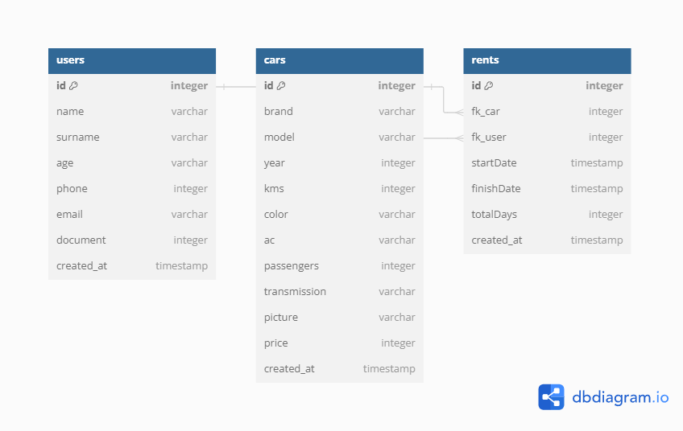
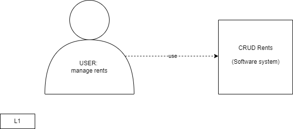
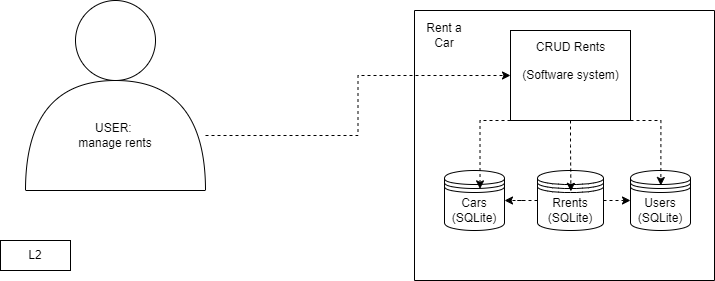
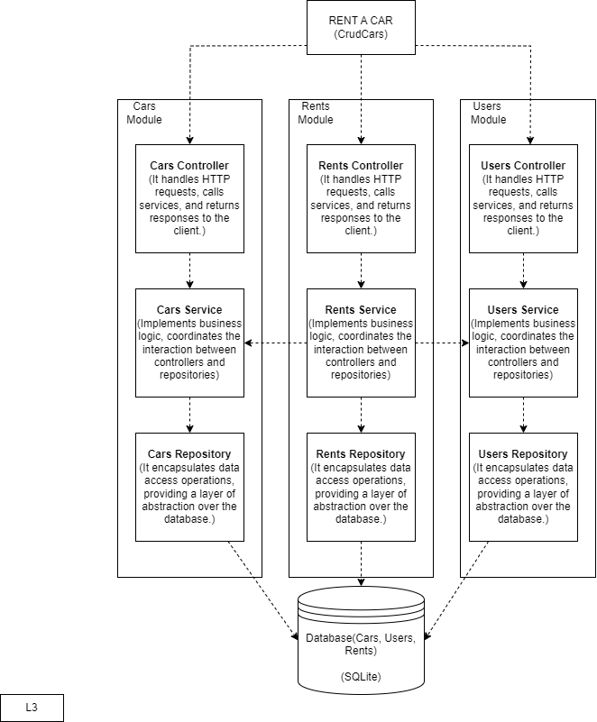

# Car Rental System

## Overview
This project is a car rental system with a layered architecture, including controllers, services, and repositories. It manages users, cars, and rental transactions.

## C4 Diagrams










## Setup

1. **Create a `.env` File**

   In the root directory of your project, create a file named `.env` and add the following configuration:
    DB_PATH=./db/database.db
    DB_TABLES_PATH=./db/tables.sql
    SESSION_SECRET=secret

2. **Run the Server**

Navigate to the `src` folder in your terminal and run the server using `nodemon`:

```bash
cd src
nodemon server.js    
```

3. **Open the Application**

Open your web browser and navigate to `http://localhost:3000` to access the application.

